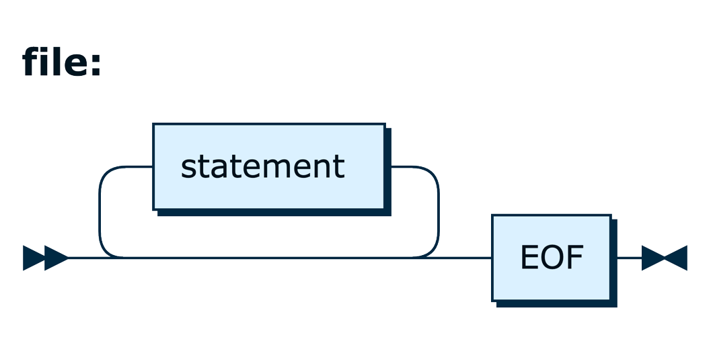

# IslandSQL

## Introduction

IslandSQL is an ANTLR 4 based parser for grammars used in SQL files.
The parser requires a Java Virtual Machine supporting version 11 or newer and is available
on [Maven Central](https://central.sonatype.com/artifact/ch.islandsql/islandsql).

## Scope

### Database Management Systems

The following table shows the DBMS and their grammar versions in scope:

| DBMS       | Grammar  | Version                  | HTML Reference (live)                                                                                        | PDF Reference (snapshot)                                                            |
|------------|----------|--------------------------|--------------------------------------------------------------------------------------------------------------|-------------------------------------------------------------------------------------|
| OracleDB   | SQL*Plus | 26ai G44104-01 (23.26.0) | [User's Guide and Reference](https://docs.oracle.com/en/database/oracle/oracle-database/26/sqpug/)           | [PDF](https://islandsql.github.io/IslandSQL/sqlplus-users-guide-and-reference.pdf)  |
|            | SQLcl    | 25.3 G40958-01           | [Users's Guide](https://docs.oracle.com/en/database/oracle/sql-developer-command-line/25.3/sqcug/index.html) | [PDF](https://islandsql.github.io/IslandSQL/oracle-sqlcl-users-guide.pdf)           |
|            | SQL      | 26ai G43935-01 (23.26.0) | [Language Reference](https://docs.oracle.com/en/database/oracle/oracle-database/26/sqlrf/)                   | [PDF](https://islandsql.github.io/IslandSQL/sql-language-reference.pdf)             | 
|            | PL/SQL   | 26ai G43964-01 (23.26.0) | [Language Reference](https://docs.oracle.com/en/database/oracle/oracle-database/26/lnpls/)                   | [PDF](https://islandsql.github.io/IslandSQL/database-pl-sql-language-reference.pdf) |
| PostgreSQL | psql     | 18.0                     | [psql — PostgreSQL interactive terminal](https://www.postgresql.org/docs/18/app-psql.html)                   | [PDF](https://islandsql.github.io/IslandSQL/postgresql.pdf)                         |
|            | SQL      | 18.0                     | [SQL Commands](https://www.postgresql.org/docs/18/sql-commands.html)                                         | [PDF](https://islandsql.github.io/IslandSQL/postgresql.pdf)                         |
|            | PL/pgSQL | 18.0                     | [PL/pgSQL — SQL Procedural Language](https://www.postgresql.org/docs/18/plpgsql.html)                        | [PDF](https://islandsql.github.io/IslandSQL/postgresql.pdf)                         |

The HTML reference shows the latest version of the document. However, the latest snapshot version in PDF format
represents the version that was used to define the grammar.

### Statements

The IslandSQL grammar covers statements that can contain static DML statements and code in PL/SQL and PL/pgSQL.

The current islands of interests are:

| Type  | Statement                             |      OracleDB      |     PostgreSQL     |
|-------|---------------------------------------|:------------------:|:------------------:|
| DDL   | `create function`                     | :white_check_mark: | :white_check_mark: |
|       | `create json relational duality view` | :white_check_mark: |        n/a         |
|       | `create materialized view`            | :white_check_mark: | :white_check_mark: |
|       | `create package`                      | :white_check_mark: |        n/a         |
|       | `create package body`                 | :white_check_mark: |        n/a         |
|       | `create procedure`                    | :white_check_mark: | :white_check_mark: |
|       | `create table`                        | :white_check_mark: | :white_check_mark: |
|       | `create trigger`                      | :white_check_mark: | :white_check_mark: |
|       | `create type`                         | :white_check_mark: | :white_check_mark: |
|       | `create type body`                    | :white_check_mark: |        n/a         |
|       | `create view`                         | :white_check_mark: | :white_check_mark: |
| DML   | `call`                                | :white_check_mark: | :white_check_mark: |
|       | `delete`                              | :white_check_mark: | :white_check_mark: |
|       | `explain plan`                        | :white_check_mark: | :white_check_mark: |
|       | `insert`                              | :white_check_mark: | :white_check_mark: |
|       | `lock table`                          | :white_check_mark: | :white_check_mark: |
|       | `merge`                               | :white_check_mark: | :white_check_mark: |
|       | `select`                              | :white_check_mark: | :white_check_mark: |
|       | `update`                              | :white_check_mark: | :white_check_mark: |
| TCL   | `begin`                               |        n/a         | :white_check_mark: |
|       | `commit`                              | :white_check_mark: | :white_check_mark: |
|       | `rollback`                            | :white_check_mark: | :white_check_mark: |
|       | `savepoint`                           | :white_check_mark: | :white_check_mark: |
|       | `set constraints`                     | :white_check_mark: | :white_check_mark: |
|       | `set transaction`                     | :white_check_mark: | :white_check_mark: |
| other | `anonymous PL/SQL block`              | :white_check_mark: |        n/a         |
|       | `do`                                  |        n/a         | :white_check_mark: |

Tokens that are not part of the statements listed above are preserved as hidden tokens. As a result, the token stream
represents the complete input (file).

Statements containing other languages such as Java or JavaScript are not within the scope of IslandSQL, as the source
code in these languages is most likely developed, linted, tested and packaged outside the database before being deployed
in the database.

## IslandSQL Grammar

The syntax diagrams of the IslandSQL grammar are produced by [RR](https://github.com/GuntherRademacher/rr)
and can be found [here](https://islandsql.github.io/IslandSQL/grammar.html).

## Frequently Asked Questions (FAQ)

See [FAQ](faq.md).

## License

IslandSQL is licensed under the Apache License, Version 2.0. You may obtain a copy of the License
at <http://www.apache.org/licenses/LICENSE-2.0>.
